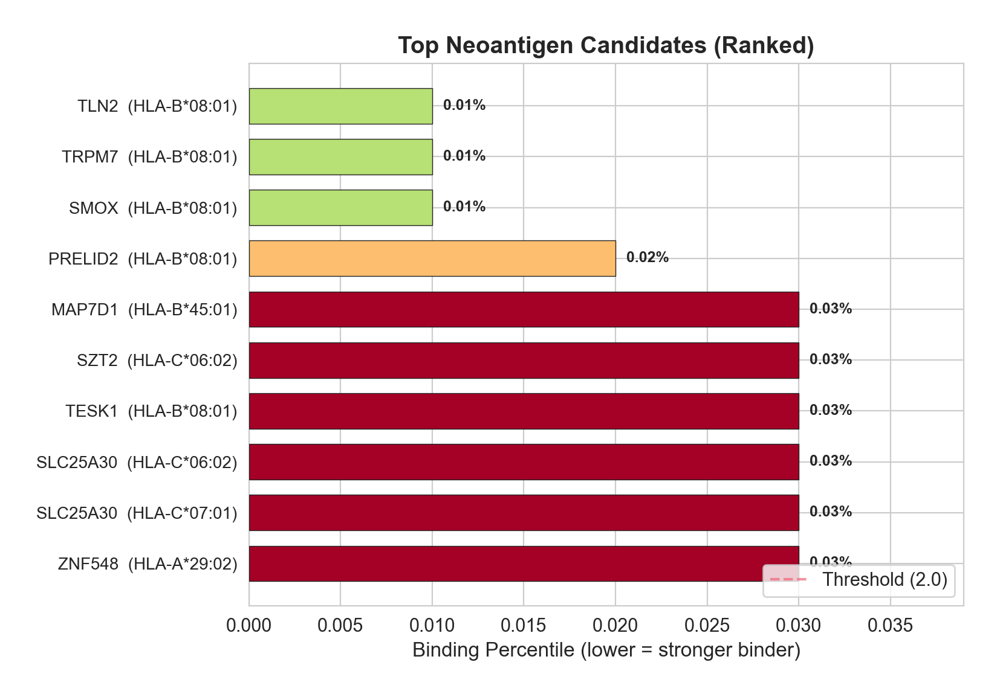
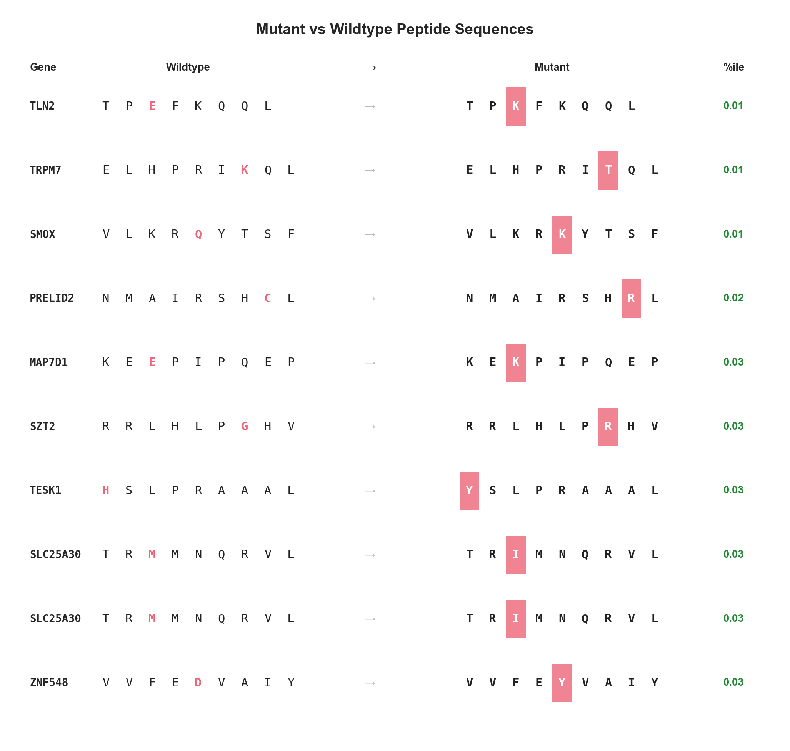
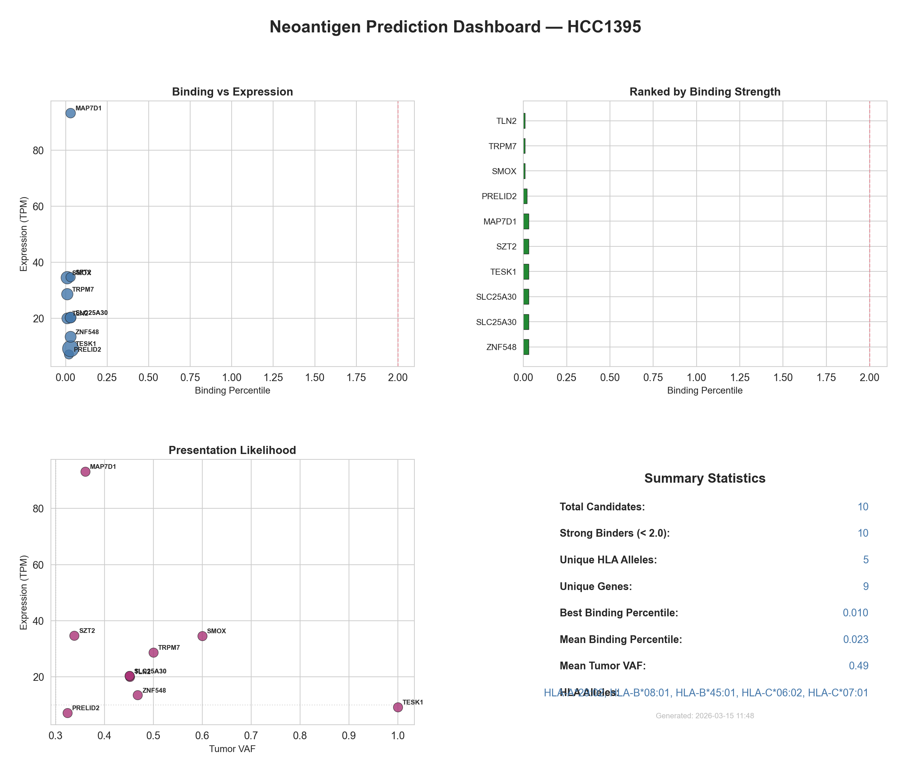
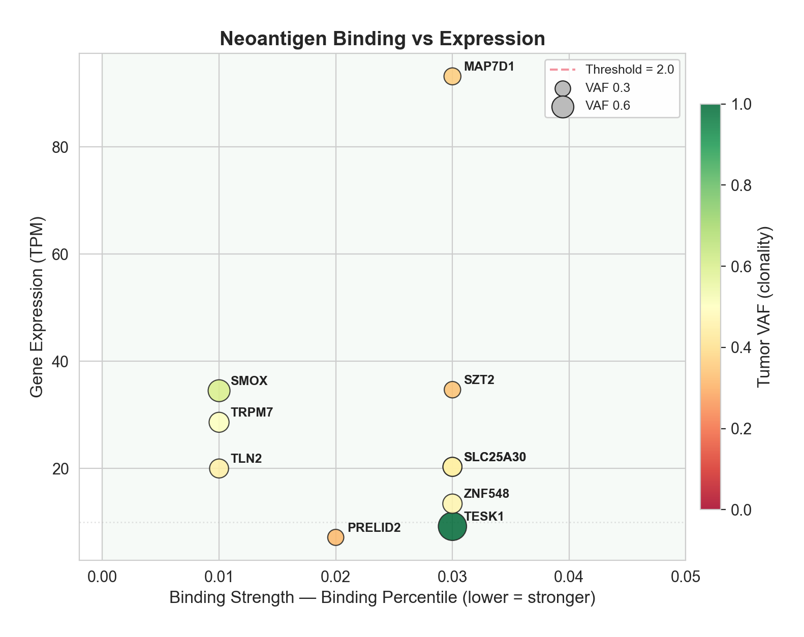
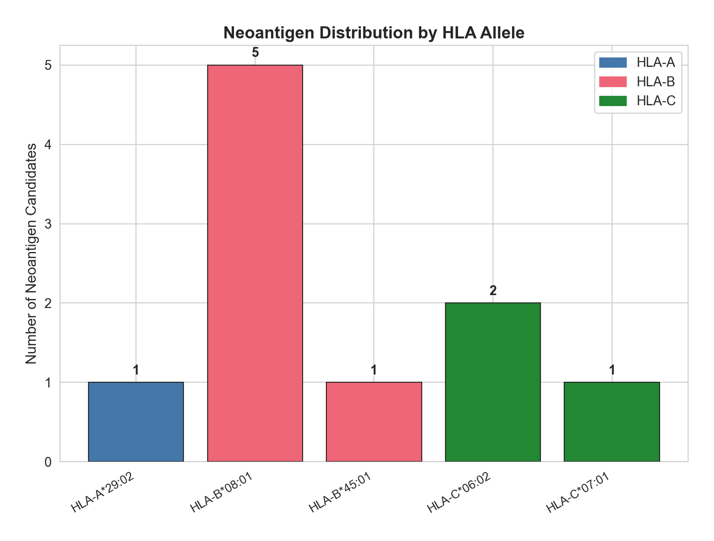
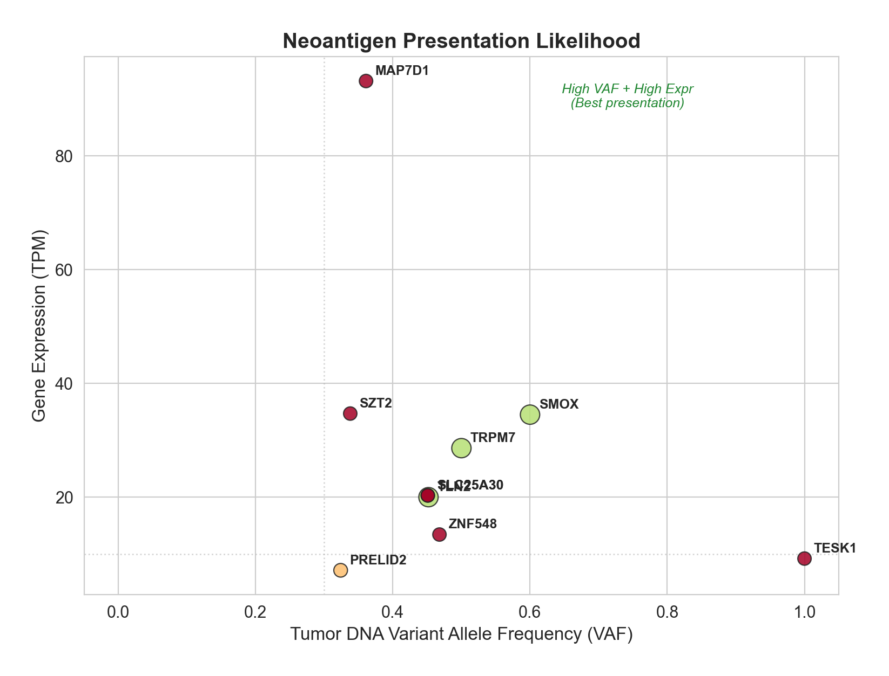
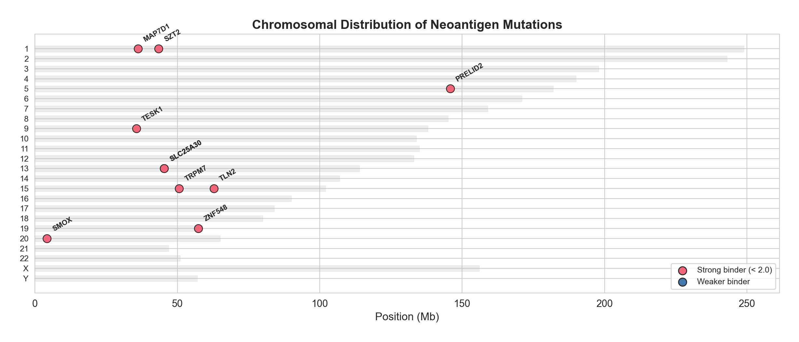

# Personal Cancer Vaccine Pipeline

> **DISCLAIMER: This is a research and educational project. It is NOT a medical product, NOT clinically validated, and NOT approved for use in humans or animals. This pipeline produces computational predictions only — it does not manufacture, test, or administer any vaccine. Do not use this software to make medical decisions. Any therapeutic application requires extensive wet-lab validation, preclinical testing, regulatory approval, and clinical oversight by qualified medical professionals. The authors assume no liability for any use of this software.**

---

End-to-end computational pipeline: from raw tumor sequencing data to a ready-to-synthesize personalized mRNA cancer vaccine sequence.

Identifies tumor-specific neoantigens, predicts 3D peptide-MHC structures with AlphaFold2, and designs an optimized mRNA construct using LinearDesign — the same approach used by BioNTech and Moderna in clinical trials.

**Tested on HCC1395 (triple-negative breast cancer). Total compute cost: ~$1 on Vast.ai.**

---

## How It Works: 9 Steps from Tumor DNA to Vaccine

### Step 1 — DNA Sequencing

Everything starts with two DNA samples: one from the **tumor** and one from **healthy tissue** (matched normal). Both are sequenced using whole-exome or whole-genome sequencing, producing raw FASTQ files — billions of short DNA reads.

For this demo we use **HCC1395**, a publicly available triple-negative breast cancer cell line, with its matched normal **HCC1395BL**. Data is on ENA (ERR194146, ERR194147).

```
Tumor sample:  HCC1395      (~8 mutations per megabase)
Normal sample: HCC1395BL    (matched blood-derived normal)
Genome build:  GRCh38 (hg38)
```

### Step 2 — Read Alignment (BWA-MEM)

Raw sequencing reads are aligned to the human reference genome (GRCh38) using **BWA-MEM**. This maps each short DNA fragment to its position in the genome. After alignment, duplicates are marked (GATK MarkDuplicates) and base quality scores are recalibrated (BQSR).

```bash
# Runs via Docker — no local installation needed
bash scripts/01_alignment.sh
```

**Output:** sorted, deduplicated BAM files for tumor and normal.

### Step 3 — Finding Mutations (GATK Mutect2)

**GATK Mutect2** compares the tumor BAM against the normal BAM to find **somatic mutations** — changes in DNA that exist only in the cancer cells, not in healthy tissue. These are the mutations that drive the cancer and can serve as vaccine targets.

The pipeline filters for high-confidence variants using contamination estimation, orientation bias filtering, and a panel of normals.

```bash
bash scripts/02_variant_calling.sh
```

**Result: 879 somatic mutations** found in HCC1395.

### Step 4 — HLA Typing (OptiType)

Every person's immune system uses **HLA molecules** (Human Leukocyte Antigen) to present peptide fragments on cell surfaces. T cells scan these peptides — if they recognize a foreign peptide (like one from a mutation), they kill the cell.

**OptiType** determines the patient's HLA type from the sequencing data. This is critical because a peptide that binds strongly to one person's HLA may not bind at all to another's.

```bash
bash scripts/03_hla_typing.sh
```

**HCC1395 HLA type:**
| Locus | Allele 1 | Allele 2 |
|-------|----------|----------|
| HLA-A | A\*29:02 | A\*29:02 (homozygous) |
| HLA-B | B\*08:01 | B\*45:01 |
| HLA-C | C\*06:02 | C\*07:01 |

### Step 5 — Variant Annotation (VEP)

**Ensembl VEP** (Variant Effect Predictor) annotates each mutation with its effect on proteins — is it a missense mutation? Does it change an amino acid? Which gene and transcript does it affect? The Frameshift and Wildtype plugins are added because pVACseq needs them.

```bash
bash scripts/04_vep_annotation.sh
```

### Step 6 — Neoantigen Prediction (pVACseq)

This is the core step. **pVACseq** takes the annotated mutations + HLA alleles and predicts which mutant peptides will bind strongly to the patient's MHC molecules. It runs two prediction algorithms:

- **NetMHCpanEL** — eluted ligand predictor, the gold standard
- **BigMHC_EL** — deep learning-based predictor

The pipeline tests all peptide lengths (8-11 amino acids) against all 5 HLA alleles, generating **29,031 peptide-MHC binding predictions**. These are filtered by binding percentile, and the top candidates are ranked.

```bash
bash scripts/05_pvacseq.sh
```

**Result: 9 top neoantigens** — all in the top 0.03% of binding strength:

| Gene | Mutant Peptide | HLA Allele | Percentile | Tumor VAF | Expression |
|------|---------------|------------|-----------|-----------|-----------|
| TLN2 | TP**K**FKQQL | B\*08:01 | 0.01% | 45% | 20 TPM |
| TRPM7 | ELHPRI**T**QL | B\*08:01 | 0.01% | 50% | 29 TPM |
| SMOX | VLKR**K**YTSF | B\*08:01 | 0.01% | 60% | 35 TPM |
| PRELID2 | NMAIRSH**R**L | B\*08:01 | 0.02% | 32% | 7 TPM |
| MAP7D1 | KE**K**PIPQEP | B\*45:01 | 0.03% | 36% | 93 TPM |
| SZT2 | RRLHLP**R**HV | C\*06:02 | 0.03% | 34% | 35 TPM |
| TESK1 | **Y**SLPRAAAL | B\*08:01 | 0.03% | 100% | 9 TPM |
| SLC25A30 | TR**I**MNQRVL | C\*06:02 | 0.03% | 45% | 20 TPM |
| ZNF548 | VVFE**Y**VAIY | A\*29:02 | 0.03% | 47% | 13 TPM |

**Bold** = mutated amino acid residue. Lower percentile = stronger binding.





### Step 7 — 3D Structure Prediction (ColabFold / AlphaFold2)

For each neoantigen, **ColabFold** (AlphaFold2-Multimer) predicts the 3D structure of the peptide-MHC complex — how the mutant peptide physically sits in the MHC binding groove. This validates that the peptide actually fits.

Each complex has 3 chains:
- **Chain A:** HLA alpha chain (~275 residues)
- **Chain B:** Beta-2-microglobulin (~99 residues)
- **Chain C:** Neoantigen peptide (8-9 residues)

We predicted all 9 complexes on Vast.ai (RTX 5080, ~3 hours, ~$0.36):

| Gene | Peptide | HLA | pLDDT | ipTM |
|------|---------|-----|-------|------|
| TLN2 | TPKFKQQL | B\*08:01 | 95.9 | 0.930 |
| TRPM7 | ELHPRITQL | B\*08:01 | 97.3 | 0.940 |
| SMOX | VLKRKYTSF | B\*08:01 | 96.1 | 0.930 |
| PRELID2 | NMAIRSHRL | B\*08:01 | 95.9 | 0.930 |
| MAP7D1 | KEKPIPQEP | B\*45:01 | **97.4** | **0.950** |
| SZT2 | RRLHLPRHV | C\*06:02 | 95.4 | 0.930 |
| TESK1 | YSLPRAAAL | B\*08:01 | 96.2 | 0.930 |
| SLC25A30 | TRIMNQRVL | C\*06:02 | 97.0 | 0.940 |
| ZNF548 | VVFEYVAIY | A\*29:02 | 96.6 | 0.940 |

**pLDDT > 70 = confident structure. ipTM > 0.6 = confident interface. All 9 are excellent (>95, >0.93).**

27 PDB files generated (9 complexes x 3 models each).

### Step 8 — mRNA Vaccine Design (LinearDesign)

Now we have validated neoantigens. **LinearDesign** (Nature, 2023) optimizes the mRNA coding sequence for maximum structural stability and translation efficiency, using lattice parsing from computational linguistics.

The pipeline assembles a complete mRNA construct following the architecture of BioNTech's BNT162b2 COVID-19 vaccine:

```
5'cap — 5'UTR (α-globin) — Kozak — tPA signal — [TLN2-AAY-TRPM7-AAY-...-ZNF548] — Stop — 3'UTR (AES+mtRNR1) — polyA (A30-linker-A70)
```

| Element | Source | Length | Purpose |
|---------|--------|--------|---------|
| 5' UTR | Human α-globin | 34 nt | High translation efficiency |
| Kozak | GCCACC | 6 nt | Ribosome start codon recognition |
| tPA signal peptide | Tissue plasminogen activator | 93 nt (31 aa) | Routes protein to ER for MHC loading |
| 9 neoantigens | pVACseq top hits | variable | Vaccine antigens |
| AAY linkers | Standard | 9 nt each | Proteasomal cleavage sites |
| Stop | UGA+UAA | 6 nt | Double stop for reliability |
| 3' UTR | AES + mtRNR1 | 255 nt | mRNA stability (BNT162b2-style) |
| Poly(A) | A30-GCAUAUGACU-A70 | 110 nt | Protection from degradation |

```bash
bash scripts/07_construct_design.sh
```

**Result:**
- Protein: 135 amino acids
- mRNA: **816 nucleotides**
- MFE: -279.7 kcal/mol (very stable)
- CAI: 0.761 (good human codon usage)

### Step 9 — Delivery (LNP Encapsulation)

The final mRNA sequence is ready for **in-vitro transcription** (IVT). During IVT:
- All U nucleotides are replaced with **N1-methylpseudouridine (Ψ)** to reduce innate immune activation
- **Cap1** structure is added co-transcriptionally

The mRNA is then encapsulated in a **lipid nanoparticle** (LNP) for delivery — the same technology used in Moderna and Pfizer COVID-19 vaccines.

> **This step is done in a wet lab, not computationally.** The pipeline ends here with a ready-to-synthesize mRNA sequence. See [docs/WHAT_NEXT.md](docs/WHAT_NEXT.md) for detailed wet-lab next steps.

---

## Visualizations

The pipeline generates publication-quality plots from the neoantigen predictions:











```bash
# Generate visualizations
uv run python scripts/utils/visualize_neoantigens.py results/real_top10.tsv
```

An interactive scrollytelling visualization of the full pipeline is at `results/vaccine_story.html` (serve via `python3 -m http.server`).

---

## Quick Start

### Easy Mode (~20 min, any machine with Docker)

```bash
git clone https://github.com/chiefautism/personal-cancer-vaccine.git
cd personal-cancer-vaccine
cp .env.example .env
bash easy_mode/run_easy_mode.sh
```

### Cloud Mode (~$1, Vast.ai)

```bash
uv tool install vastai
vastai set api-key YOUR_KEY
bash scripts/run_vastai.sh --easy
```

### Full Mode (~18h, from raw FASTQ)

```bash
bash scripts/download_demo_data.sh      # ~40GB tumor + normal FASTQ
bash scripts/download_references.sh     # ~30GB GRCh38 + databases
bash scripts/run_pipeline.sh --mode full
```

---

## Cost Breakdown

### Easy Mode (pre-processed data, neoantigen prediction only)

| Resource | Cost |
|----------|------|
| Vast.ai RTX 5080 instance (~45 min) | $0.09 |
| **Total** | **~$0.10** |

Runs in ~20 minutes on any machine with Docker (free). Vast.ai optional for speed.

### Full Mode (raw FASTQ to complete mRNA vaccine)

| Step | Tool | Time | Vast.ai Cost |
|------|------|------|-------------|
| Download data | wget | 30 min | — |
| Alignment | BWA-MEM | 8-10h | $0.96-1.20 |
| Variant calling | Mutect2 | 4-6h | $0.48-0.72 |
| HLA typing | OptiType | 15-30 min | $0.03-0.06 |
| VEP annotation | VEP | 30-60 min | $0.06-0.12 |
| Neoantigen prediction | pVACseq | 30-90 min | $0.06-0.18 |
| Structure prediction | ColabFold | 2-3h | $0.24-0.36 |
| mRNA optimization | LinearDesign | <1 min | $0.00 |
| Construct assembly | Python | instant | $0.00 |
| **Total** | | **~16-22h** | **$1.83-2.64** |

Based on Vast.ai RTX 5080 at $0.12/hr. Actual cost of our HCC1395 run: $0.96 (8 hours including setup, debugging, and all retries).

### What is NOT included in the cost

The computational pipeline ends at an mRNA sequence file. The following wet-lab costs are separate and not part of this project:

| Wet-lab step | Estimated cost | Who does it |
|-------------|---------------|-------------|
| Custom mRNA synthesis (IVT) | $500-2,000 | RNA synthesis company |
| LNP encapsulation | $1,000-5,000 | Formulation lab |
| Quality control | $2,000-10,000 | GMP lab |
| Preclinical testing | $50,000+ | Research institution |
| Clinical trial | $1M+ | Hospital / pharma |

---

## Using Your Own Data

1. Edit `.env` and `config/pipeline_config.yaml` with your sample names and FASTQ paths
2. `bash scripts/run_pipeline.sh --mode full`
3. `bash scripts/07_construct_design.sh`

Works with any human tumor/normal pair on GRCh38.

---

## Context

This pipeline replicates the computational approach used in real clinical programs:

| Program | Company | Phase | Neoantigens | Result |
|---------|---------|-------|-------------|--------|
| V940 (mRNA-4157) | Moderna/Merck | Phase 3 | Up to 34 | 49% reduction in melanoma recurrence at 3 years |
| BNT122 (autogene cevumeran) | BioNTech | Phase 2 | Up to 20 | 6/8 responders disease-free at 3 years (pancreatic) |
| Rosie (dog) | Paul Conyngham / UNSW | Case study | Custom | 75% tumor shrinkage with AI-designed mRNA vaccine |

---

## Project Structure

```
personal-cancer-vaccine/
├── scripts/
│   ├── run_pipeline.sh              # Master orchestrator
│   ├── run_vastai.sh                # Vast.ai cloud launcher
│   ├── 01_alignment.sh              # BWA-MEM + BQSR
│   ├── 02_variant_calling.sh        # Mutect2
│   ├── 03_hla_typing.sh             # OptiType
│   ├── 04_vep_annotation.sh         # VEP + plugins
│   ├── 05_pvacseq.sh                # Neoantigen prediction
│   ├── 06_postprocess.sh            # Reports + viz
│   ├── 07_construct_design.sh       # mRNA vaccine assembly
│   └── utils/
│       ├── visualize_neoantigens.py # 7 plots + HTML report
│       └── assemble_construct.py    # mRNA construct builder
├── notebooks/
│   └── colabfold_neoantigen_structures.ipynb
├── config/                          # Pipeline parameters
├── docker/                          # Docker compose
├── sample_output/                   # Pre-generated results + figures
├── docs/
│   ├── WHAT_NEXT.md                 # Wet-lab next steps
│   ├── ARCHITECTURE.md              # Technical details
│   └── TROUBLESHOOTING.md           # Common issues
└── results/                         # Pipeline output (gitignored)
```

## TODO

- [ ] RNA-seq integration (STAR + expression quantification)
- [ ] MHC Class II predictions (CD4+ T-cell epitopes)
- [ ] Fusion neoantigen detection (STAR-Fusion → pVACfuse)
- [ ] HLA loss-of-heterozygosity detection
- [ ] Immunogenicity prediction (BigMHC_IM)
- [ ] Nextflow wrapper
- [ ] Canine genome branch (CanFam4 + DLA alleles)

## References

- **pVACtools**: Hundal et al. (2020) *Cancer Immunology Research*
- **GATK Mutect2**: Van der Auwera & O'Connor (2020) *O'Reilly*
- **BWA-MEM**: Li (2013) *arXiv:1303.3997*
- **OptiType**: Szolek et al. (2014) *Bioinformatics*
- **VEP**: McLaren et al. (2016) *Genome Biology*
- **ColabFold**: Mirdita et al. (2022) *Nature Methods*
- **LinearDesign**: Zhang et al. (2023) *Nature*
- **HCC1395 data**: Griffith Lab, Washington University School of Medicine

## License

MIT — see [LICENSE](LICENSE).
